# 📦 Entidad: Product (Producto)

Esta entidad representa el núcleo del catálogo de ventas. Cada producto debe pertenecer a una Marca (Brand) existente.

## 📋 Modelo de Datos

```mermaid
erDiagram
    BRAND ||--|{ PRODUCT : has
    PRODUCT {
        int id PK
        string name "Nombre del producto"
        string sku "Stock Keeping Unit (Unique)"
        string code "Código de Barras (Unique)"
        decimal price "Precio de venta"
        int brand_id FK "Referencia a Brand"
        string image_url "URL imagen opcional"
        boolean is_active "Soft Delete Support"
        datetime created_at
    }
    BRAND {
        int id PK
        string name
    }
```



### Características Técnicas

*   **Soft Delete**: Los productos no se borran físicamente, solo se marcan como `is_active=False`.
*   **Validaciones Únicas**:
    *   `sku` debe ser único globalmente.
    *   `code` (Código de barras) debe ser único globalmente.
*   **Relaciones**: `Many-to-One` con **Brand**. Si se intenta crear un producto con una marca inexistente, la API retorna error.

---

## ⚡ Flujo de Creación (Sequence Diagram)

```mermaid
sequenceDiagram
    participant Client
    participant API as FastAPI (ProductRouter)
    participant Service as ProductService
    participant DB as PostgreSQL

    Client->>API: POST /products/ (JSON)
    API->>Service: create_product(db, schema)

    Service->>DB: INSERT INTO products...

    alt Brand ID no existe
        DB-->>Service: IntegrityError (Relation fk_brand)
        Service-->>API: Raise ValueError("Brand does not exist")
        API-->>Client: 409 Conflict
    else SKU/Code ya existe
        DB-->>Service: IntegrityError (UniqueConstraint)
        Service-->>API: Raise ValueError("Duplicate SKU/Code")
        API-->>Client: 409 Conflict
    else Éxito
        DB-->>Service: Success
        Service->>DB: Refresh(product)
        Service-->>API: ProductRead Object
        API-->>Client: 201 Created (JSON Completo)
    end
```



---

## 📡 Ejemplos de API (JSON Reales)

### 1. Crear un Producto

**Request:** `POST /products/`

```json
{
  "name": "Coca-Cola Zero 2.5L",
  "sku": "COCA-ZERO-2500",
  "code": "7809876543210",
  "price": 2590.00,
  "brand_id": 1
}
```

**Response (201 Created):**

```json
{
  "name": "Coca-Cola Zero 2.5L",
  "sku": "COCA-ZERO-2500",
  "code": "7809876543210",
  "price": "2590.00",
  "brand_id": 1,
  "image_url": null,
  "id": 3,
  "is_active": true,
  "created_at": "2026-01-08T15:38:25.489838Z"
}
```

### 2. Listar Productos

**Request:** `GET /products/`

**Response (200 OK):**

```json
[
  {
    "name": "Coca-Cola 1.5L",
    "sku": "SKU-COCA-1500",
    "code": "7801234567890",
    "price": "1490.00",
    "brand_id": 1,
    "image_url": "https://img.example.com/coca.jpg",
    "id": 1,
    "is_active": true,
    "created_at": "2026-01-08T15:20:26.730886Z"
  }
]
```

### 3. Obtener Detalle

**Request:** `GET /products/1`

**Response (200 OK):**

Same as above object.

### 4. Eliminar Producto (Soft Delete)

**Request:** `DELETE /products/1`

**Response:** `204 No Content`

> **Nota:** El producto sigue en base de datos pero con `is_active=False` y ya no aparecerá en el listado general.

---

## 🛠️ Notas de Implementación

*   Se utiliza `logging` para capturar errores de base de datos sin exponer detalles sensibles al cliente.
*   El campo `price` usa tipo de dato `Decimal` para precisión financiera exacta.
*   Se implementó un filtro global en los getters para devolver solo `is_active=True`, a menos que se use un endpoint de administración específico (futuro).
